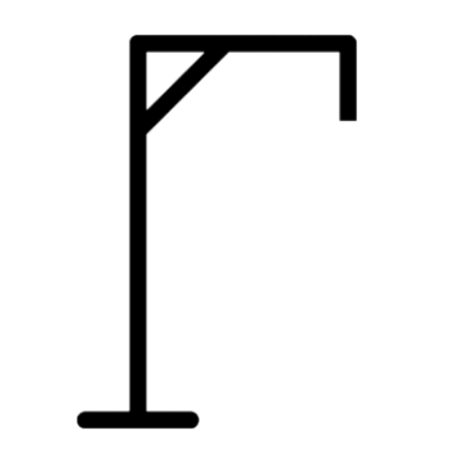
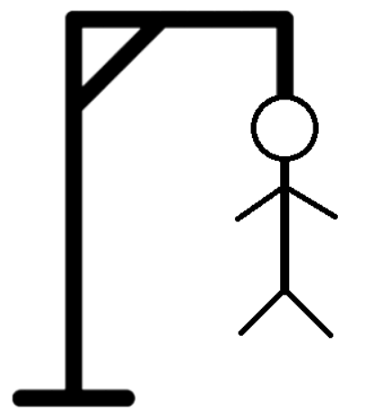
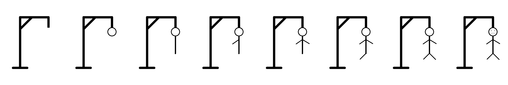

Hangman Game

Description:

**classic Hangman game**   
This game challenges players to guess a randomly selected word within a limited number of attempts.
The game fetches a **random word** from an external API and provides an option to display its **definition** as a hint.  
Players must guess the word letter by letter, and incorrect guesses decrease the available attempts.  
The game ends when the word is guessed correctly or when the player runs out of attempts.

Features:

Introduction- 
 

- Interactive gameplay with letter input fields

- Random word generation using an external API

- Optional word definition hints

- Animated Hangman graphics

- Sound effects for correct and incorrect guesses

- Game over screen with retry option

- Adjustable sound volume in settings

- Smooth animations and transitions 

- 🎲 **Random Word Generation** – Fetches words dynamically using an API.  

- 📖 **Definition Hints** – Displays the meaning of the word (optional). 

- 🔊 **Sound Effects** – Includes scribble and hanged sounds.  

- 📱 **Responsive Design** – Optimized for different screen sizes.  

- 🎨 **Smooth Animations** – Engaging animations for user interactions. 

-Closure- 
 

Fully responsive design

Technologies Used:

HTML

CSS

JavaScript

- **APIs**:
  - [Random Word API](https://random-word-api.herokuapp.com/)
  - [Dictionary API](https://api.dictionaryapi.dev/)

- **Styling**: Google Fonts, CSS animations

How to Play: 

1. Click the "Start" button to begin.

2. A random word is chosen, and you must guess it letter by letter.

3. Correct guesses turn green; incorrect guesses draw parts of the Hangman.

4. You have **7 chances** to guess the word before losing. 
 

5. Click "Retry" to play again.

Installation & Setup:

Download or clone the repository

Clone the repository:

git clone https://github.com/saivarun0007/Hangman Game.git

Navigate to the project directory:

cd Hangman Game

Open index.html in your browser.

File Structure:

📂 Hangman-Game 
│── index.html        # Main HTML file 
│── style.css         # Stylesheet for UI design 
│── script.js         #  JavaScript logic for the game 
│── favicon.avif      # Game icon 
│── README.md         # Project documentation 
└── LICENSE           # MIT License file 

Credits:

Developed by CHANDRUPATLA SAI VARUN

License:

This project is licensed under the MIT License. Feel free to use and modify it!
